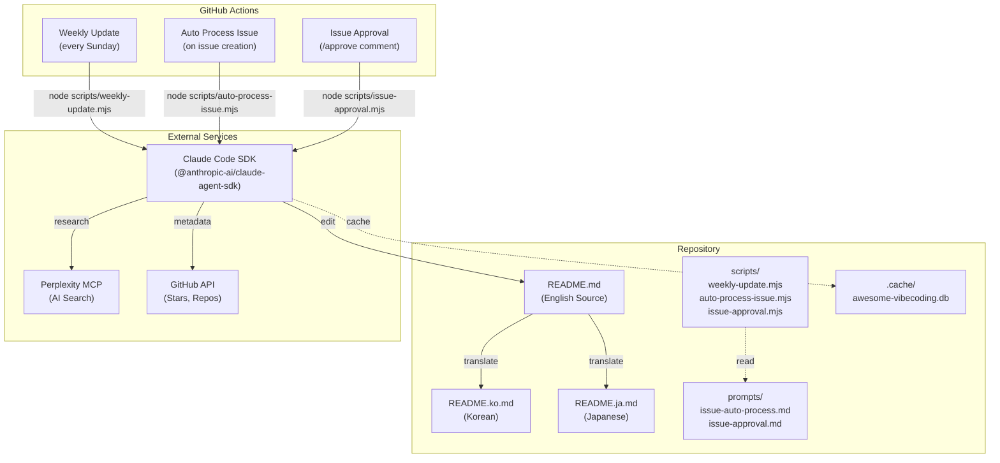
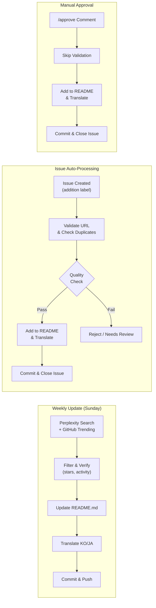

# Awesome Vibe Coding

*Language: [English](README.md) | [한국어](README.ko.md) | [日本語](README.ja.md)*

A curated list of resources for **Vibe Coding**—the AI-native programming paradigm where you describe your intent in natural language and let AI generate the code.

> **Maintained by AI**: This repository is automatically updated weekly using [Claude Code](https://claude.ai/code) + [Perplexity MCP](https://github.com/ppl-ai/modelcontextprotocol). Translations sync automatically via Claude Code hooks. [Learn how →](docs/automation.md)

> **"Fully give in to the vibes, embrace exponentials, and forget that the code even exists."**
> — Andrej Karpathy, February 2025

---

## Contents

- [What is Vibe Coding?](#what-is-vibe-coding)
- [Key Principles](#key-principles)
- [Tools](#tools)
  - [IDE & Editor Assistants](#ide--editor-assistants)
  - [Agentic Coding Environments](#agentic-coding-environments)
  - [MCP Servers & Tooling](#mcp-servers--tooling)
  - [Cloud & Platform Integrations](#cloud--platform-integrations)
- [Workflows & Templates](#workflows--templates)
- [Best Practices](#best-practices)
- [Domain Applications](#domain-applications)
- [Learning Resources](#learning-resources)
  - [Research Papers](#research-papers)
  - [Articles & Manuals](#articles--manuals)
  - [Videos & Tutorials](#videos--tutorials)
- [Community](#community)
- [Related Awesome Lists](#related-awesome-lists)
- [Contributing](#contributing)

---

## What is Vibe Coding?

[Vibe Coding](https://en.wikipedia.org/wiki/Vibe_coding) is an AI-assisted programming approach where users describe their problem in natural language, and AI generates the necessary code without requiring the developer to deeply understand or engage with detailed code logic. The term was coined by AI researcher **Andrej Karpathy** in February 2025.

### Paradigm Comparison

| Paradigm | Approach | Human Role | Best For |
|----------|----------|------------|----------|
| **Traditional Coding** | Manual syntax-based writing | Writes/reads all code | Full control, production systems |
| **AI-Assisted Coding** | LLM suggests, human reviews/edits | Reviews and refines code | Faster development with oversight |
| **Vibe Coding** | Natural language to AI, test-only evaluation | Guides via intent, tests outcomes | Rapid prototyping, MVPs |

---

## Key Principles

- **Natural Language First** — Describe what you want, not how to implement it
- **Specification vs Vibe** — Loose, intent-driven descriptions over exhaustive specs
- **Context Management** — Maintain state across multi-turn conversations
- **Responsibility Boundaries** — Humans handle judgment/testing; AI handles generation
- **Trust Building** — Iterative testing and feedback foster reliance on AI outputs
- **Embrace Uncertainty** — Accept AI code based on tests, not line-by-line review

---

## Tools

### IDE & Editor Assistants

AI-powered code completion and assistance integrated into your development environment.

| Tool | Description |
|------|-------------|
| [**GitHub Copilot**](https://github.com/features/copilot) | AI pair programmer with autocomplete, chat, multi-IDE support |
| [**Cursor**](https://www.cursor.com/) | VS Code fork with contextual code generation and inline chat |
| [**Windsurf**](https://codeium.com/windsurf) | AI-native IDE from Codeium with Cascade AI and multi-LLM support |
| [**Claude Code**](https://docs.anthropic.com/en/docs/agents-and-tools/claude-code/overview) | Anthropic's CLI-based agentic coding assistant |
| [**OpenAI Codex CLI**](https://openai.com/codex/) | Open-source CLI coding agent with natural language prompts |
| [**Google Jules**](https://jules.google) | Autonomous AI coding agent powered by Gemini 2.5 Pro |
| [**Gemini Code Assist**](https://cloud.google.com/products/gemini/code-assist) | Google's AI code completion and chat for Cloud/IDEs |
| [**dbForge AI Assistant**](https://www.devart.com/dbforge/ai-assistant/) | AI-powered SQL coding tool, integrated into dbForge products |
| [**JetBrains AI**](https://www.jetbrains.com/ai/) | Deep integration in IntelliJ/PyCharm with Junie agent |
| [**Augment Code**](https://www.augmentcode.com) | Enterprise AI with deep context and security (SOC 2) |
| [**Tabnine**](https://www.tabnine.com/) | Deep learning autocomplete adapting to your coding style |
| [**Amazon Q Developer**](https://aws.amazon.com/q/developer/) | AWS-integrated AI coding assistant |
| [**Continue**](https://www.continue.dev) | Open-source configurable AI assistant framework |
| [**Qodo**](https://www.qodo.ai) | AI code review engine (formerly CodiumAI) |
| [**Sourcegraph Cody**](https://sourcegraph.com/cody) | AI assistant for code understanding and search |
| [**Supermaven**](https://supermaven.com) | High-speed AI code completion |
| [**Cline**](https://github.com/cline/cline) | Open-source AI assistant with file/terminal/browser automation |
| [**Roo Code**](https://github.com/RooVetGit/Roo-Code) | AI assistant supporting multiple roles (architect, QA, PM) |
| [**Google Antigravity**](https://antigravity.google) | Agent-first IDE with multi-agent orchestration (Gemini 3 Pro) |
| [**opencode**](https://github.com/opencode-ai/opencode) | Open-source TUI coding agent with multi-provider and MCP support |
| [**Aider**](https://github.com/paul-gauthier/aider) | AI pair programming in terminal with git integration |
| [**Zed AI**](https://zed.dev/) | High-performance editor with native AI assistant integration |
| [**Void**](https://github.com/voideditor/void) | Open-source VS Code fork with autonomous AI coding capabilities |
| [**Melty**](https://github.com/meltylabs/melty) | Chat-first code editor with conversational interface |
| [**CodeGPT**](https://codegpt.co) | AI coding assistant with multi-LLM support for VS Code and IDEs |
| [**Wingman AI**](https://github.com/RussellCanfield/wingman-ai-vscode-extension) | Open-source VSCode extension supporting Ollama, HuggingFace, OpenAI, Anthropic |
| [**DeepSeek CLI**](https://github.com/holasoymalva/deepseek-cli) | Terminal AI coding assistant powered by DeepSeek Coder models |
| [**Codeium**](https://codeium.com/) | Free AI code completion with 70+ language support |
| [**Pieces for Developers**](https://pieces.app/) | AI assistant with automatic code snippet management and context |
| [**Refact.ai**](https://refact.ai/) | Privacy-focused self-hosted AI coding assistant |
| [**Mutable.ai**](https://mutable.ai/) | AI for automated testing, documentation, and refactoring |
| [**CopilotKit**](https://github.com/CopilotKit/CopilotKit) | Framework for building AI copilots with chat and generative UI |
| [**Kiro**](https://kiro.dev) | AWS spec-driven AI IDE turning requirements into code and tests |
| [**Warp**](https://www.warp.dev) | AI-native terminal with natural language commands and agent mode |
| [**PearAI**](https://trypear.ai) | Open-source VS Code AI editor with integrated search |
| [**OpenPaw**](https://github.com/daxaur/openpaw) | CLI tool that extends Claude Code into a personal assistant with 38+ skills |
| [**Gemini CLI**](https://github.com/google-gemini/gemini-cli) | Google's open-source agentic CLI for coding powered by Gemini models |
| [**Tabby**](https://tabbyml.com) | Self-hosted, open-source AI coding assistant with privacy-first design |
| [**Aide**](https://aide.dev) | Open-source VS Code fork with proactive AI agent that can fix issues across the codebase |
| [**Blackbox AI**](https://www.blackbox.ai) | AI code completion and generation supporting 20+ languages, popular for in-browser coding |
| [**llm.log**](https://github.com/lanesket/llm.log) | Local proxy that captures AI agent API calls — tokens, costs, prompts, latency in a TUI dashboard |
| [**Phind**](https://www.phind.com) | AI-powered developer search engine for code, errors, and technical Q&A |
| [**Bito AI**](https://bito.ai) | AI code review and generation assistant for VS Code and JetBrains IDEs |
| [**PR-Agent**](https://github.com/Codium-ai/pr-agent) | Open-source AI agent for automated pull request analysis and review |
| [**Caliber**](https://github.com/caliber-ai-org/ai-setup) | CLI that generates and syncs AI agent configs for Claude Code, Cursor, and Codex |
| [**roboco-cli**](https://github.com/roboco-io/roboco-cli) | AI-native development scaffolding system for vibe coding with Claude Code |
| [**vibe-ready**](https://github.com/roboco-io/vibe-ready-cli) | CLI tool that analyzes repository readiness for vibe coding using Claude Agent SDK with 6-category scoring |
| [**oh-my-claudecode**](https://github.com/Yeachan-Heo/oh-my-claudecode) | Multi-agent orchestration for Claude Code with zero learning curve |
| [**vmux**](https://github.com/roboco-io/vmux) | VS Code terminal extension for AI coding agents with notifications and session management |
| [**Codebuff**](https://github.com/CodebuffAI/codebuff) | Open-source terminal AI agent with sub-agent coordination, 61% SWE-bench accuracy |
| [**Crush**](https://github.com/charmbracelet/crush) | Glamorous terminal AI coding agent by Charmbracelet with LSP integration and multi-model support |
| [**Open WebUI**](https://github.com/open-webui/open-webui) | Self-hosted AI interface with 139K+ stars, 290M downloads, offline-first (Ollama/OpenAI) |

### Agentic Coding Environments

Autonomous AI systems that handle end-to-end development tasks.

| Tool | Description |
|------|-------------|
| [**Devin**](https://www.cognition.ai/devin) | Autonomous AI software engineer by Cognition |
| [**OpenHands**](https://github.com/All-Hands-AI/OpenHands) | Open-source autonomous AI software developer |
| [**Goose**](https://block.github.io/goose/) | Open-source coding assistant by Block with MCP support |
| [**OpenManus**](https://github.com/mannaandpoem/OpenManus) | Open-source framework for AI-assisted document creation |
| [**Vibe Compiler (vibec)**](https://github.com/Strawberry-Computer/vibe-compiler) | Self-compiling tool that transforms prompts into code |
| [**AlphaCode**](https://alphacode.deepmind.com/) | DeepMind's competitive programming AI |
| [**Cherry Studio**](https://github.com/CherryHQ/cherry-studio) | AI Agent desktop with autonomous coding and 300+ assistants |
| [**OpenSpec**](https://github.com/Fission-AI/OpenSpec) | Spec-driven development framework for AI coding assistants |
| [**SWE-agent**](https://github.com/princeton-nlp/SWE-agent) | Stanford agent that autonomously solves GitHub issues |
| [**gpt-engineer**](https://github.com/gpt-engineer-org/gpt-engineer) | Build entire codebases from natural language specifications |
| [**MetaGPT**](https://github.com/geekan/MetaGPT) | Multi-agent framework simulating software company roles |
| [**AutoGPT**](https://github.com/Significant-Gravitas/AutoGPT) | Autonomous AI agent for complex coding tasks |
| [**Sweep**](https://github.com/sweepai/sweep) | AI-powered GitHub assistant for issues and PRs |
| [**Devika**](https://github.com/stitionai/devika) | First open-source agentic software engineer alternative to Devin |
| [**smol-ai developer**](https://github.com/smol-ai/developer) | Embeddable developer agent library for apps |
| [**E2B**](https://github.com/e2b-dev/e2b) | Secure cloud sandbox environment for enterprise-grade AI agents |
| [**Plandex**](https://plandex.ai) | Open-source terminal AI coding engine for complex multi-step tasks |
| [**Cosine**](https://cosine.sh) | Autonomous AI software engineer for complex codebase tasks |
| [**Factory**](https://factory.ai) | AI Droids for autonomous code review, testing, and PR creation |
| [**Amp**](https://ampcode.com) | Sourcegraph's terminal-first agentic coding assistant |
| [**Devon**](https://github.com/entropy-research/Devon) | Open-source autonomous coding agent, alternative to Devin |
| [**Copilot Workspace**](https://githubnext.com/projects/copilot-workspace) | GitHub's agentic environment for issue-to-PR workflows |
| [**Agentless**](https://github.com/OpenAutoCoder/Agentless) | Minimalist open-source approach to autonomous software engineering |
| [**Suna**](https://github.com/kortix-ai/suna) | Open-source generalist AI agent with browser, code execution, and file system for dev tasks |
| [**micro-agent**](https://github.com/BuilderIO/micro-agent) | CLI tool that writes and iteratively fixes code using TDD until tests pass |
| [**Potpie**](https://github.com/potpie-ai/potpie) | Open-source AI agents for codebase debugging, testing, and code review |
| [**RA.Aid**](https://github.com/ai-christianson/RA.Aid) | Autonomous dev agent combining research, planning, and multi-step code generation |
| [**serverless-openclaw**](https://github.com/serithemage/serverless-openclaw) | Run OpenClaw AI agent on-demand on AWS serverless infrastructure with Web UI and Telegram interfaces |
| [**serverless-autoresearch**](https://github.com/roboco-io/serverless-autoresearch) | Parallel evolution pipeline for Karpathy's autoresearch on SageMaker Spot Training (H100) with HUGI pattern |
| [**mymir**](https://github.com/FrkAk/mymir) | Project management layer for AI coding agents with context network |
| [**Langflow**](https://github.com/langflow-ai/langflow) | Open-source visual AI agent builder with drag-and-drop canvas (149K+ stars) |

### MCP Servers & Tooling

[Model Context Protocol](https://modelcontextprotocol.io/) servers that extend AI capabilities.

| Category | Servers | Description |
|----------|---------|-------------|
| **Git Operations** | [Git](https://github.com/modelcontextprotocol/servers/tree/main/src/git), [Rube](https://github.com/ComposioHQ/Rube), [GitHub](https://github.com/modelcontextprotocol/servers/tree/main/src/github) | Repository read/search/manipulation, issue/PR management |
| **Databases** | [ClickHouse](https://github.com/ClickHouse/mcp-clickhouse), [MongoDB](https://github.com/mongodb-js/mongodb-mcp-server), [Chroma](https://github.com/chroma-core/chroma-mcp), [Excel](https://github.com/haris-musa/excel-mcp-server), [PostgreSQL](https://github.com/modelcontextprotocol/servers/tree/main/src/postgres), [Neon](https://github.com/neondatabase/mcp-server-neon) | Query, migrations, semantic search, spreadsheet operations, serverless Postgres |
| **Security** | [Semgrep](https://github.com/semgrep/mcp), [Sentry](https://github.com/getsentry/sentry-mcp) | Code scanning, error tracking |
| **Browser & Automation** | [Chrome MCP](https://github.com/hangwin/mcp-chrome), [Playwright MCP](https://github.com/executeautomation/mcp-playwright), [AnyCrawl](https://github.com/any4ai/anycrawl-mcp-server), [Fetch](https://github.com/modelcontextprotocol/servers/tree/main/src/fetch), [Puppeteer](https://github.com/modelcontextprotocol/servers/tree/main/src/puppeteer), [Firecrawl MCP](https://github.com/mendableai/firecrawl-mcp-server) | Browser automation, testing, web scraping, content fetching |
| **Mobile** | [Mobile MCP](https://github.com/mobile-next/mobile-mcp) | iOS/Android automation and scraping (emulators, simulators, real devices) |
| **Search & Knowledge** | [Brave Search](https://github.com/modelcontextprotocol/servers/tree/main/src/brave-search), [Exa](https://github.com/exa-labs/exa-mcp-server), [Perplexity](https://github.com/anthropics/mcp-perplexity), [Tavily](https://github.com/tavily-ai/tavily-mcp), [Solar MCP](https://github.com/serithemage/solar-mcp), [Botmadang MCP](https://github.com/serithemage/botmadang-mcp) | Web search, semantic search, research, AI-optimized search, Upstage Solar models, Korean social platform |
| **Development** | [Xcode Build MCP](https://github.com/cameroncooke/XcodeBuildMCP), [Spec Workflow MCP](https://github.com/Pimzino/spec-workflow-mcp), [Slack](https://github.com/modelcontextprotocol/servers/tree/main/src/slack), [Linear](https://github.com/jerhadf/linear-mcp-server) | Xcode integration, spec-driven development, team communication, project management |
| **CI/CD** | [GitHub MCP](https://github.com/github/github-mcp-server) | Full GitHub API access for issues, PRs, and Actions |
| **Execution** | [E2B](https://github.com/e2b-dev/mcp-server) | Secure cloud sandbox for AI-generated code execution |
| **Docs** | [Context7](https://github.com/upstash/context7) | Up-to-date library documentation injected into AI context |
| **File System** | [Filesystem](https://github.com/modelcontextprotocol/servers/tree/main/src/filesystem) | Secure read/write operations |
| **Payments** | [Stripe](https://github.com/stripe/agent-toolkit) | Official Stripe MCP for payments, customers, and subscriptions |
| **Agent Trust** | [TWZRD Agent Intel](https://intel.twzrd.xyz) | On-chain trust scoring for AI agent wallets before x402 micropayments. Free MCP: `{"mcpServers":{"twzrd-agent-intel":{"url":"https://intel.twzrd.xyz/mcp"}}}` |
| **Browser (Cloud)** | [Browserbase](https://github.com/browserbase/mcp-server-browserbase) | Cloud browser automation MCP for AI agents |
| **Backend** | [Supabase](https://github.com/supabase-community/supabase-mcp) | Manage Supabase projects, run SQL, and handle migrations |
| **Design** | [Figma](https://github.com/figma/figma-developer-mcp) | Figma design data for AI-powered frontend development |
| **Cloud Infrastructure** | [Cloudflare](https://github.com/cloudflare/mcp-server-cloudflare) | Manage Cloudflare Workers, KV, D1, and R2 via AI |
| **MCP Clients** | [5ire](https://github.com/nanbingxyz/5ire) | Cross-platform desktop AI assistant with MCP support and local knowledge base |
| **Productivity** | [Notion MCP](https://github.com/makenotion/notion-mcp-server) | Official Notion MCP server for reading and writing pages, databases, and blocks |
| **Deployment** | [Vercel MCP](https://github.com/vercel/mcp-adapter) | Deploy projects, manage domains, and configure env vars via AI |
| **Project Management** | [Jira MCP](https://github.com/sooperset/mcp-atlassian) | Atlassian Jira and Confluence integration for issue and doc management |
| **Multi-Service** | [Composio](https://github.com/ComposioHQ/composio) | MCP automation connecting Linear, Notion, Slack and 100+ services for AI agents |

📚 See [awesome-mcp-servers](https://github.com/wong2/awesome-mcp-servers) for a comprehensive list.

### Cloud & Platform Integrations

Browser-based and cloud platforms for AI-assisted development.

| Tool | Description |
|------|-------------|
| [**Replit**](https://replit.com/) | Browser-based IDE with Ghostwriter AI |
| [**v0**](https://v0.dev/) | Vercel's AI for UI/React generation |
| [**Bolt.new**](https://bolt.new/) | Natural language app building by StackBlitz |
| [**Lovable**](https://lovable.dev/) | Full-stack app generation with Supabase |
| [**Berrry**](https://berrry.app) | Transform social posts into web apps |
| [**Duet AI**](https://workspace.google.com/solutions/ai/) | Google Workspace AI integration |
| [**Trae AI**](https://www.trae.ai/) | AI platform for content creation |
| [**CodeSandbox AI**](https://codesandbox.io/ai) | AI-powered code generation in browser sandbox |
| [**GitHub Copilot Workspace**](https://github.com/features/copilot) | AI-native development environment for GitHub |
| [**Create.xyz**](https://create.xyz/) | Build web apps using natural language prompts |
| [**Wordware**](https://www.wordware.ai/) | No-code AI agent builder for developers |
| [**Kombai**](https://kombai.com/) | AI that converts Figma designs to code |
| [**Dyad**](https://github.com/dyad-sh/dyad) | Local open-source AI app builder (v0/Lovable/Bolt alternative) |
| [**Firebase Studio**](https://firebase.studio) | Google's AI-first browser IDE with Gemini, formerly Project IDX |
| [**Google AI Studio**](https://aistudio.google.com) | Browser IDE for building and prototyping with Gemini models |
| [**Databutton**](https://databutton.com) | AI-powered full-stack app builder with Python backend |
| [**Tempo Labs**](https://tempolabs.ai/) | AI-powered React UI builder with visual editor and code export |
| [**Gitpod**](https://www.gitpod.io/) | Cloud dev environments with AI-assisted workspace automation |
| [**Bolt.diy**](https://github.com/stackblitz-labs/bolt.diy) | Open-source Bolt.new alternative with bring-your-own-API-key support |
| [**Marblism**](https://marblism.com) | AI that generates full-stack Next.js apps from a text prompt |
| [**Subframe**](https://subframe.com) | AI-assisted UI builder that generates clean React component code |
| [**BuildShip**](https://buildship.com) | Visual AI workflow and backend builder with low-code nodes |
| [**Onlook**](https://onlook.dev) | Open-source browser-based visual editor for React/Next.js with AI code generation |
| [**GitHub Spark**](https://githubnext.com/projects/spark) | Natural language micro-app builder by GitHub Next, runs in the browser |
| [**Dify**](https://github.com/langgenius/dify) | Open-source platform for building and deploying LLM-powered applications |
| [**Lazy AI**](https://www.getlazy.ai) | Chat-based web app builder with one-click cloud deployment |
| [**Rosebud AI**](https://rosebud.ai) | Vibe coding platform for 3D games and interactive web apps |
| [**Emergent**](https://emergent.sh) | AI full-stack vibe coding platform with one-click deployment and custom domains |
| [**Hostinger Horizons**](https://hostinger.com/horizons) | AI no-code app builder with voice/text/image prompts and built-in hosting |

---

## Workflows & Templates

| Workflow | Key Steps |
|----------|-----------|
| **New Feature** | Vibe Brief → Verify with PRD → Vertical slice plan → Implement stepwise |
| **Refactoring** | Analyze patterns/smells → Safety strategy → Sequential small steps |
| **Bug Fixing** | Triage & hypotheses → Minimal failing test → Fix → Verify |
| **Test Generation** | Identify critical behaviors → Prioritize by risk → Generate tests |

**Recommended Artifacts**: PRD.md, TECH_DESIGN.md, NOTES.md, CHANGELOG.md

📚 **[Full Workflows & Templates Guide →](docs/workflows-and-templates.md)** — Session setup, prompt templates, playbooks

---

## Best Practices

### Do's ✅

- **Start with context** — Provide architecture, constraints, relevant code
- **Decompose tasks** — Break into planning → generation → testing → refactoring
- **Test first** — Generate tests before or alongside code
- **Use sandboxes** — Run AI code in isolated environments
- **Review as "junior engineer"** — Always human-review for security and architecture
- **Maintain artifacts** — Keep PRD, NOTES, CHANGELOG updated

### Don'ts ❌

- **Skip review for "simple" code** — AI can introduce subtle bugs
- **Include secrets in prompts** — Use environment variables or vaults
- **Feed proprietary code to public models** — Risk of data leakage
- **Accept raw output blindly** — Vibe ≠ vibes without verification
- **Over-rely on AI for complex decisions** — Humans handle judgment

---

## Domain Applications

| Domain | Use Cases | Example Tools |
|--------|-----------|---------------|
| **Web/App/Backend** | CRUD apps, SaaS, microservices | [Lovable](https://lovable.dev/), [Cursor](https://www.cursor.com/), [v0](https://v0.dev/) |
| **Data & ML** | Pipeline generation, experiment automation | [Zapier](https://zapier.com/), [n8n](https://n8n.io/) |
| **DevOps** | IaC, CI/CD setup, monitoring | [Pulumi](https://www.pulumi.com/), [Terraform](https://www.terraform.io/) |
| **Research** | Notebook automation, data visualization | [ChatGPT](https://chat.openai.com/), [Claude](https://claude.ai/) |

---

## Learning Resources

### Research Papers

| Paper | Focus | Link |
|-------|-------|------|
| **Vibe Coding: Toward an AI-Native Paradigm** | Semantic software development | [arXiv:2510.17842](https://arxiv.org/abs/2510.17842) |
| **A Review on Vibe Coding** | Fundamentals, challenges, future directions | [TechRxiv](https://www.techrxiv.org/users/913189/articles/1292402) |
| **Vibe Coding and AI-Led Conversational Programming** | Developer-AI interaction | [SSRN](https://papers.ssrn.com/sol3/papers.cfm?abstract_id=5469367) |
| **Vibe Coding: AI/Voice Based Code Generation** | Research tool for non-coders | [ICAIR](https://papers.academic-conferences.org/index.php/icair/article/view/3975) |
| **SWE-bench: Can Language Models Resolve Real-World GitHub Issues?** | Standard benchmark for evaluating AI coding agents | [arXiv:2310.06770](https://arxiv.org/abs/2310.06770) |
| **SWE-agent: Agent-Computer Interfaces Enable Automated Software Engineering** | Autonomous agent fixing real bugs using Agent-Computer Interface | [arXiv:2405.15793](https://arxiv.org/abs/2405.15793) |

### Articles & Manuals

- [What is Vibe Coding? (IBM)](https://www.ibm.com/think/topics/vibe-coding) — Enterprise perspective
- [Vibe Coding Manual (Roboco)](https://roboco.io/posts/vibe-coding-manual/) — Comprehensive guide with templates
- [Context Engineering Intro (coleam00)](https://github.com/coleam00/context-engineering-intro) — How to make AI coding assistants work effectively with Claude Code
- [12 Best Practices for AI Coding (Questera)](https://www.questera.ai/blogs/12-best-practices-to-use-ai-in-coding-in-2025) — 2025 best practices
- [Secure Vibe Coding Guide (CSA)](https://cloudsecurityalliance.org/blog/2025/04/09/secure-vibe-coding-guide) — Security considerations
- [Here's how I use LLMs to help me write code (Simon Willison)](https://simonwillison.net/2025/Mar/11/using-llms-for-code/) — Practical integration tips
- [Agentic Coding (Armin Ronacher)](https://lucumr.pocoo.org/2025/6/12/agentic-coding/) — AI-driven autonomous development approaches
- [The Model Context Protocol Guide (Anthropic)](https://modelcontextprotocol.io/introduction) — Understanding MCP architecture
- [vibecodex](https://github.com/yerdaulet-damir/vibecodex) — Production architecture bible with 54 principles for vibe-coding (FastAPI, Next.js, Go)

### Videos & Tutorials

| Video | Topic |
|-------|-------|
| [**Vibe Coding Tutorial and Best Practices**](https://www.youtube.com/watch?v=YWwS911iLhg) | AI agents in Cursor/Windsurf |
| [**Vibe Coding Is The Future**](https://www.youtube.com/watch?v=IACHfKmZMr8) | Y Combinator on vibe coding |
| [**How I use LLMs**](https://www.youtube.com/watch?v=EWvNQjAaOHw) | Andrej Karpathy's guide |
| [**Model Context Protocol Explained**](https://www.youtube.com/watch?v=VChRPFUzJGA) | MCP fundamentals |
| [**Windsurf: 90% of Your Code**](https://www.youtube.com/watch?v=bVNNvWq6dKo) | Agentic IDE deep dive |
| [**Vibecoding is Here**](https://www.youtube.com/watch?v=xxA-M3HrKrc) | AI changing development |
| [**New Tools for Building Agents**](https://www.youtube.com/watch?v=hciNKcLwSes) | OpenAI's agent tools |
| [**AI Tool Showdown (Japanese)**](https://www.youtube.com/watch?v=EQHXIVItNxs) | Copilot vs Cursor vs others |
| [**MCP in 10 Minutes**](https://www.youtube.com/watch?v=EswVjHZMn74) | Quick MCP intro |

---

## Community

### Reddit

- [r/vibecoding](https://reddit.com/r/vibecoding) — Dedicated vibe coding community
- [r/ChatGPTCoding](https://reddit.com/r/ChatGPTCoding) — ChatGPT + coding workflows
- [r/ClaudeAI](https://reddit.com/r/ClaudeAI) — Claude and Claude Code discussions
- [r/CursorAI](https://reddit.com/r/CursorAI) — Cursor IDE workflows and tips
- [r/copilot](https://reddit.com/r/copilot) — GitHub Copilot community
- [r/Jetbrains](https://reddit.com/r/Jetbrains) — JetBrains IDEs and AI Assistant
- [r/Tabnine](https://reddit.com/r/Tabnine) — Tabnine AI autocomplete
- [r/continue_dev](https://reddit.com/r/continue_dev) — Continue.dev open-source assistant
- [r/LocalLlama](https://reddit.com/r/LocalLlama) — Local LLM development
- [r/replit](https://reddit.com/r/replit) — Replit & Ghostwriter community

### Discord

- [Cursor Discord](https://discord.gg/cursor) — Workflows, extensions, project showcases
- [Lovable AI Discord](https://discord.gg/lovable) — Full-stack app generation sharing
- [Bolt.new Discord](https://discord.gg/stackblitz) — Natural language app building (StackBlitz)
- [v0 by Vercel Discord](https://discord.gg/vercel) — UI/React generation community
- [Replit Discord](https://discord.gg/replit) — Multiplayer vibe coding

### Starter Kits

- [vibe-coding-prompt-template](https://github.com/KhazP/vibe-coding-prompt-template) — Comprehensive prompt templates
- [awesome-vibe-coding](https://github.com/filipecalegario/awesome-vibe-coding) — Another curated list (2.8k stars)
- [vibeworkflow.app](https://vibeworkflow.app) — Workflow automation for vibe coding
- [Dev Janitor](https://github.com/cocojojo5213/Dev-Janitor) — Cross-platform desktop toolkit for managing AI coding assistants and dependencies
- [everything-claude-code](https://github.com/serithemage/everything-claude-code) — Battle-tested Claude Code configs (agents, skills, hooks, commands) from Anthropic hackathon winner
- [vibe-lead](https://github.com/roboco-io/vibe-lead) — Change management framework for AI-based vibe coding adoption in organizations
- [intent-engineering](https://github.com/roboco-io/intent-engineering) — Operating model for shipping intent instead of code with AI execution

---

## Related Awesome Lists

- [awesome-code-ai](https://github.com/sourcegraph/awesome-code-ai) — AI coding tools by Sourcegraph
- [awesome-ai-assisted-coding](https://github.com/saviorand/awesome-ai-assisted-coding) — AI-assisted coding resources
- [awesome-mcp-servers](https://github.com/wong2/awesome-mcp-servers) — Model Context Protocol servers
- [awesome-chatgpt](https://github.com/humanloop/awesome-chatgpt) — ChatGPT resources
- [awesome-cursorrules](https://github.com/PatrickJS/awesome-cursorrules) — Community-curated `.cursorrules` files for Cursor IDE
- [awesome-vibe-coding](https://github.com/taskade/awesome-vibe-coding) — 245+ vibe coding tools, platforms, and resources by Taskade

---

## Contributing

This repository is **fully automated with AI**. Content updates, translations, and curation are handled by **Claude Code SDK** and **Perplexity MCP** via GitHub Actions. Weekly updates run automatically every Sunday, and approved issues are processed and merged without manual intervention.

### Architecture

### Automation Workflows

### How to Contribute

1. **Open an Issue** — [Create a new issue](../../issues/new) with your suggestion
   - New tool or resource to add
   - Correction or update to existing content
   - New category or section idea
2. **Describe Your Suggestion** — Include name, URL, and brief description
3. **Automatic Processing** — Once a maintainer comments `/approve`, Claude Code automatically adds the resource, generates translations, and commits to main

> **Please submit issues, not pull requests.** This repository is AI-operated — Claude Code handles all content editing, formatting, and translation (English, Korean, Japanese) to ensure consistency. Direct PRs will likely cause merge conflicts with the automated pipeline.

### Curation Principles

Resources should be:
- **Relevant** — Directly related to vibe coding or AI-assisted development
- **Quality** — Well-maintained, documented, and actively used
- **Accessible** — Free or with free tier available preferred

---

## License

This work is dedicated to the public domain under the [CC0 1.0 Universal License](https://creativecommons.org/publicdomain/zero/1.0/).
